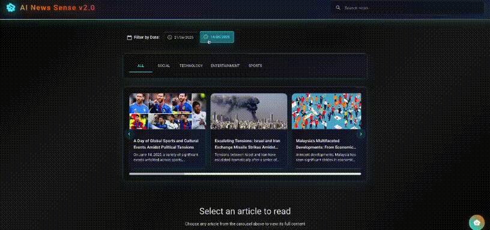
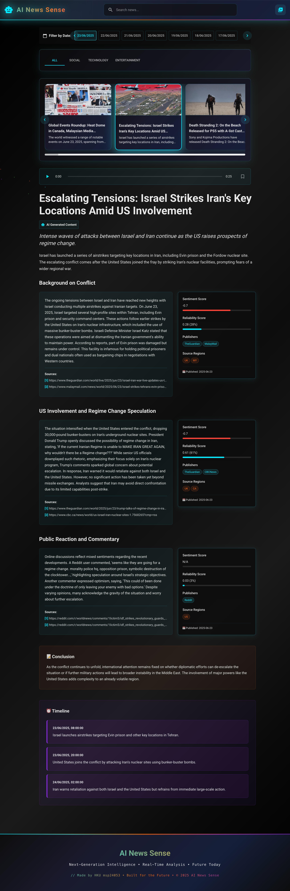

# LLM-NewsHub

An end-to-end AI-powered news generation system that scrapes, classifies, clusters, and generates multimedia news content using Large Language Models.



---

## What It Does

LLM-NewsHub automates the entire news production workflow:

1. **Scrapes** news articles from Fundus and social media from Reddit
2. **Extracts** structured event and statement cards from raw content
3. **Classifies** articles by category (KNN/SVC) and detects fake news (Random Forest)
4. **Clusters** related stories using TF-IDF + K-Means
5. **Generates** full articles with LLMs, including images and audio summaries
6. **Serves** everything through a React + FastAPI web application

---

## How It Works

```
┌─────────────┐    ┌──────────────┐    ┌───────────────┐
│  Scrapers    │───>│  Card Gen    │───>│  Classifier   │
│  (Fundus,    │    │  (Event &    │    │  (Category +  │
│   Reddit)    │    │  Statement)  │    │  Fake News)   │
└─────────────┘    └──────────────┘    └───────┬───────┘
                                               │
                   ┌──────────────┐    ┌───────▼───────┐
                   │  Article Gen │<───│   Clustering  │
                   │  (LLM)       │    │  (TF-IDF +    │
                   └──────┬───────┘    │   K-Means)    │
                          │            └───────────────┘
              ┌───────────┼───────────┐
              ▼           ▼           ▼
        ┌──────────┐ ┌──────────┐ ┌──────────┐
        │  Image   │ │  Audio   │ │ Summary  │
        │  (SD)    │ │  (TTS)   │ │  Video   │
        └──────────┘ └──────────┘ └──────────┘
              │           │           │
              └───────────┼───────────┘
                          ▼
                   ┌──────────────┐
                   │  Web App     │
                   │  (React +    │
                   │  FastAPI)    │
                   └──────────────┘
```

### Pipeline Steps

| Step | Command | Description |
|------|---------|-------------|
| Scrape | `python scrapers/fundus/scraper.py` | Fetch news articles from web sources |
| Cards | `python card/event/process.py` | Extract structured event/statement cards |
| Cluster | `python cluster/group_content.py` | Group related stories together |
| Generate | `python generate_article/generate_article.py` | Generate articles with LLM |
| Audio | `python deployment/audio/main.py` | Create audio summaries via TTS |
| Image | `python deployment/image/main.py` | Generate article images |
| Summary | `python deployment/summary/generate_summary.py` | Compile summary videos |
| Migrate | `python migrate.py` | Push generated content to web app |

Run the full pipeline:

```bash
python pipeline/run.py --date "2025-06-21"
```

---

## Tech Stack

### Backend Pipeline
- **Python 3.10** — Core language
- **PyTorch** — Deep learning framework
- **Transformers** (HuggingFace) — LLM integration
- **sentence-transformers** — Semantic embeddings
- **scikit-learn** — Classification (KNN, SVC, Random Forest) and clustering (K-Means)
- **NLTK / TextBlob / VADER** — NLP and sentiment analysis
- **BeautifulSoup / PRAW / feedparser** — Web scraping
- **OpenCV / Pillow** — Image processing
- **gTTS / edge-tts** — Text-to-speech

### Web Application
- **FastAPI** — REST API backend
- **React 18** (TypeScript) — Frontend UI
- **Material UI** — Component library
- **Recharts** — Data visualization
- **Docker Compose** — Containerized deployment

### Infrastructure
- **Docker** — Containerization
- **Nginx** — Reverse proxy for frontend
- **Airflow** (experimental) — Workflow orchestration
- **Kubernetes / Minikube** (experimental) — Orchestration experiments

---

## Quick Start

### 1. Install Dependencies

```bash
make setup
```

Or manually:

```bash
pip install -r requirements.txt
python -c "import nltk; nltk.download('punkt'); nltk.download('stopwords')"
```

### 2. Configure Environment

```bash
cp .env.example .env
# Edit .env with your API keys (LLM provider, Reddit, etc.)
```

### 3. Run the Pipeline

```bash
python pipeline/run.py --date "2025-06-21"
```

### 4. Launch the Web App

```bash
cd apps
docker compose up
```

Visit `http://localhost:3000`

### 5. Sync Generated Content to Web App

```bash
python migrate.py --date "2025-06-21"
```

---

## Project Structure

```
LLM-NewsHub/
├── apps/                    # Web application
│   ├── app/                 #   FastAPI backend
│   │   ├── api/             #     API endpoints
│   │   ├── core/            #     Configuration
│   │   ├── schemas/         #     Pydantic models
│   │   └── services/        #     Business logic
│   └── frontend/            #   React frontend (TypeScript)
├── scrapers/                # Data collection
│   ├── fundus/              #   News article scraper
│   ├── reddit/              #   Reddit scraper
│   └── trust_score/         #   Publisher trust scoring
├── card/                    # Content structuring
│   ├── event/               #   Event card extraction
│   └── statement/           #   Statement card extraction
├── classifier/              # ML models
│   ├── category/            #   News category classifier (KNN/SVC)
│   └── fake_news/           #   Fake news detector (Random Forest)
├── cluster/                 # Content grouping (TF-IDF + K-Means)
├── generate_article/        # LLM article generation
├── deployment/              # Multimedia generation
│   ├── audio/               #   Text-to-speech
│   ├── image/               #   Image generation (Stable Diffusion)
│   ├── summary/             #   Video summary creation
│   └── video/               #   Wav2Lip face-sync (optional)
├── evaluate/                # Content quality evaluation
├── data/                    # Schemas, outputs, knowledge graph
├── pipeline/                # Pipeline orchestration
├── infrastructure/          # Airflow & cloud experiments
└── requirements/            # Dependency files
```

---

## Optional Components

### Wav2Lip Video Generation

Generates lip-synced news anchor videos:

```bash
git submodule update --init --recursive
conda create -n llm-news-video python=3.8
conda activate llm-news-video
pip install -r requirements/wav2lip.txt
python pipeline/run_video.py --date "2025-06-21"
```

### Knowledge Graph

Generate a knowledge graph from processed data:

```bash
python data/output/generate_kg.py
```

---

## API Endpoints

| Method | Endpoint | Description |
|--------|----------|-------------|
| GET | `/api/health` | Health check |
| GET | `/api/news` | List news articles |
| GET | `/api/news/{id}` | Get article by ID |
| POST | `/api/chat` | Chat with news assistant |
| GET | `/api/config` | Get app configuration |

---

## Environment

- **OS**: macOS (M1 Pro), Linux, Windows
- **Python**: 3.10+
- **Docker**: For web app deployment
- **RAM**: 8GB minimum, 16GB recommended

---

## License

MIT License. See [license](license) for details.

---

## Full Screen Demo


